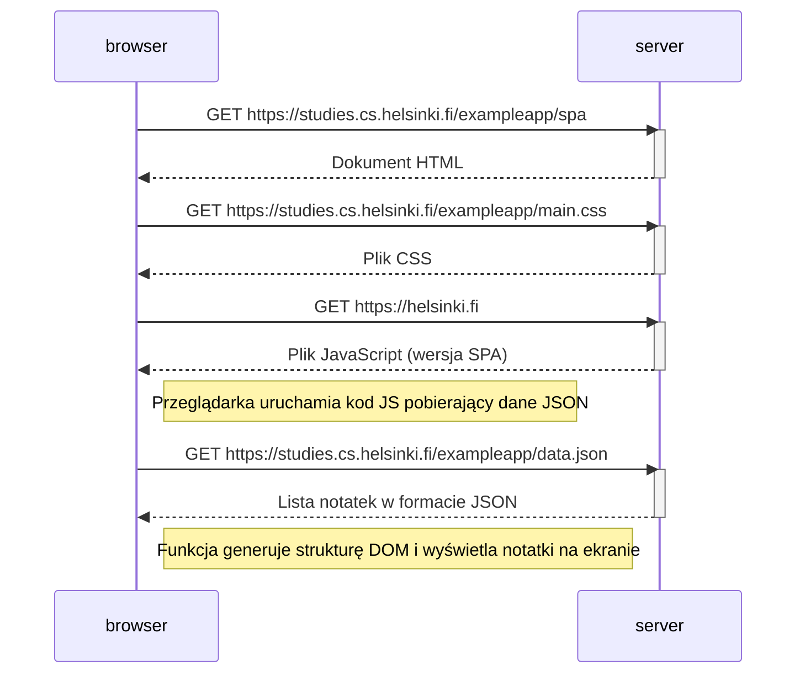

```mermaid
sequenceDiagram
    participant browser
    participant server

    browser->>server: GET https://studies.cs.helsinki.fi/exampleapp/spa
    activate server
    server-->>browser: Dokument HTML
    deactivate server

    browser->>server: GET https://studies.cs.helsinki.fi/exampleapp/main.css
    activate server
    server-->>browser: Plik CSS
    deactivate server

    browser->>server: GET https://helsinki.fi
    activate server
    server-->>browser: Plik JavaScript (wersja SPA)
    deactivate server

    Note right of browser: Przeglądarka uruchamia kod JS pobierający dane JSON

    browser->>server: GET https://studies.cs.helsinki.fi/exampleapp/data.json
    activate server
    server-->>browser: Lista notatek w formacie JSON
    deactivate server

    Note right of browser: Funkcja generuje strukturę DOM i wyświetla notatki na ekranie
```
